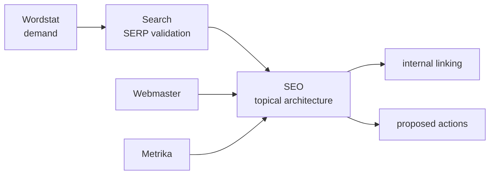
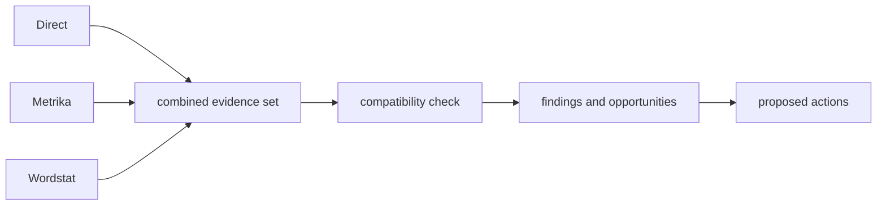

<p align="center"></p>

<p align="center"><a href="README.md">Русский</a> · <strong>English</strong></p>

<p align="center">   </p>

# Yandex AI Plugins

A marketplace of independent AI plugins **for Yandex services**: Direct, Metrika, Webmaster, Wordstat, Search, plus cross-service SEO/Marketing orchestration.

The plugins give AI agents specialized skills, access to the relevant service data, and shared rules for safe operation. This is not a plugin set for YandexGPT: each plugin owns a specific domain and operates inside explicit access boundaries.

The current published repository version is `1.4.0`. Plugin versions evolve independently. Historical published releases and tags remain immutable and are not retargeted to newer commits.

## What this is and who it is for

Use this repository when an AI agent must do more than “know about Yandex” and needs to perform practical work on real data: analyze advertising and traffic, research demand, inspect indexing, work with search results, build an SEO view, and prepare safe changes.

Typical use cases include:

- paid search and performance analytics;
- web analytics and goals;
- technical SEO and indexing;
- demand and keyword research;
- search-result and competitor analysis;
- cross-service SEO and marketing workflows.

You do not need to install the whole marketplace. Connect only the plugins required by a project.

## Plugins

| Plugin | Version | Type | Main use | Data changes |
|---|---:|---|---|---|
| [`yandex-direct`](plugins/yandex-direct/) | 2.1.0 | service | campaigns, reports, keywords, budgets, audit | only after exact preview and separate approval |
| [`yandex-metrika`](plugins/yandex-metrika/) | 2.1.0 | service | analytics, goals, attribution, Logs API, imports | only after exact preview and separate approval |
| [`yandex-webmaster`](plugins/yandex-webmaster/) | 2.1.0 | service | indexing, queries, recrawl, sitemaps, feeds | only after exact preview and separate approval |
| [`yandex-wordstat`](plugins/yandex-wordstat/) | 1.1.2 | service | demand, frequency, dynamics, regions, topics | no consequential writes |
| [`yandex-search`](plugins/yandex-search/) | 1.0.2 | service | SERP, rankings, competitors, clustering | none |
| [`yandex-seo`](plugins/yandex-seo/) | 1.2.0 | cross-service | organic evidence, topical architecture, internal linking, weekly report | proposes actions and delegates writes to service plugins |
| [`yandex-marketing`](plugins/yandex-marketing/) | 1.1.0 | cross-service | paid acquisition, reconciliation, opportunity analysis | proposes actions and delegates writes to service plugins |

Full capability and ownership matrix: [`docs/SERVICE_MATRIX.en.md`](docs/SERVICE_MATRIX.en.md).

## Core capabilities

### Safe changes

Operations that modify Yandex service data follow one shared sequence:

```text
read → analyze → preview → approval → write → verify
```

Direct, Metrika, and Webmaster do not perform a consequential change immediately after an agent recommendation. They first produce an exact preview with `preview_id`, and the user separately approves that exact operation. If the request, target, or execution context changes, a new preview is required.

Large or unknown operation sizes require the additional `--ack-bulk` gate. Successful execution returns a `yandex-ai-execution/v1` receipt.

A successful API response does not by itself prove that service state was independently read back. The current verification capability is therefore represented truthfully as `RESPONSE_ONLY` / `UNVERIFIED`, while unavailable rollback is represented as `NOT_AVAILABLE`.

Normative contract: [`docs/PLUGIN_STANDARD.en.md`](docs/PLUGIN_STANDARD.en.md).

### Project memory

The repository includes `.yandex-ai/` project memory for durable context across separate agent runs:

- `project.yaml` stores project information and user-stated facts;
- `decisions.jsonl` stores a safe history of executed decisions;
- `baselines/` stores immutable baseline snapshots with freshness metadata;
- `hypotheses.md` stores hypotheses and derived conclusions with explicit provenance labels.

```bash
python scripts/ya_project.py init --root . --project-id my-project --name "My project"
python scripts/ya_project.py check --root .
```

Memory stores data, not authority. A historical approval or receipt never replaces a new approval for a new operation.

See [`docs/GETTING_STARTED.en.md`](docs/GETTING_STARTED.en.md) and [`docs/ARCHITECTURE.en.md`](docs/ARCHITECTURE.en.md).

### Weekly organic report

`yandex-seo` can build a portable weekly organic-search report from compatible Webmaster and Metrika data. The SEO plugin does not need its own Yandex API credentials and can work from prepared input data.

```bash
cd plugins/yandex-seo
python scripts/seo_weekly_report.py demo --output-root ./artifacts --generated-at 2026-09-06T12:30:00Z
```

The output package includes machine-readable `report.json`, self-contained `report.html`, and a SHA-256 manifest. Existing snapshots are not overwritten on conflict, and proposed actions remain `PREVIEW-ONLY`. The artifact schemas are `seo-weekly-organic-report/v1` and `yandex-ai-artifact-manifest/v1`.

See [`plugins/yandex-seo/README.en.md`](plugins/yandex-seo/README.en.md).

### Model quality evaluation

P3 added executable infrastructure for checking how different AI models perform on the same plugin scenarios. It is provider-neutral: a concrete model is connected through an adapter while evaluation rules remain shared.

A quick local scenario check does not invoke external models:

```bash
python scripts/ya_eval.py check --plugins all
```

A full run can use external subject models and an independent judge model while recording mechanical checks, semantic evaluation, backend equivalence, and Project Memory behavior separately.

The currently proven status is **infrastructure ready** (`INFRASTRUCTURE_READY`). The final comparative state (`COMPARATIVE_COMPLETE`) is not claimed yet: it requires real runs with at least two distinct subject models and an independent judge on real scenarios. Green CI and fake adapters do not prove that state.

That validation work is the next practical stage after the engineering implementation.

## 3-minute quick start

### 1. Connect the marketplace

Compatible manifests are located at the repository root:

```text
.agents/plugins/marketplace.json
.claude-plugin/marketplace.json
```

For an OpenAI Workspace with GitHub marketplace import: **Workspace settings → Plugins → Add → Import marketplace**. Set Source to this repository URL and leave Path empty.

For other compatible runtimes, use their supported plugin import or registration flow.

Full guide: [`docs/GETTING_STARTED.en.md`](docs/GETTING_STARTED.en.md).

### 2. Choose the required plugins

Examples:

- demand research → Wordstat;
- technical SEO → Webmaster;
- SERP analysis → Search;
- full organic analysis → Wordstat + Search + Webmaster + Metrika + SEO;
- paid acquisition → Direct + relevant Metrika/Wordstat data + Marketing.

A service plugin owns its own credentials and API transport. `yandex-seo` and `yandex-marketing` do not own Yandex credentials of their own.

### 3. Start with a read operation

For example, Direct:

```bash
cd plugins/yandex-direct
export YANDEX_DIRECT_TOKEN='...'
python scripts/yd_api.py campaigns get --params '{"SelectionCriteria":{},"FieldNames":["Id","Name","Status"]}'
```

First verify that the agent can see the intended account and read the expected data. Introduce write capability only where it is actually required.

## How a work task flows

A user asks: “Find campaigns with problems and propose budget changes.”

1. The agent routes the task to `yandex-direct`.
2. The plugin reads the required campaign and report data and preserves source context.
3. The agent analyzes the data and explains the recommendation.
4. If a change is needed, the plugin shows an exact preview with `preview_id`.
5. The user approves that exact preview in a later message.
6. The service plugin executes the operation and returns an execution receipt.
7. If separate read-back verification is available, actual service state is confirmed independently.

For cross-service SEO/Marketing work, the orchestration plugin first combines data from several services and delegates any possible write back to the service plugin that owns the relevant API.

## SEO and Marketing orchestration

### SEO



Wordstat provides demand data, Search validates the SERP, and Webmaster/Metrika provide existing-site context. SEO combines them without owning its own Yandex API transport. The two sequential contract layers are named `Topical Architecture` and `Internal Linking`.

See [`docs/ARCHITECTURE.en.md`](docs/ARCHITECTURE.en.md) and [`plugins/yandex-seo/README.en.md`](plugins/yandex-seo/README.en.md).

### Marketing



Overlapping Direct and Metrika metrics are not summed automatically. The workflow first determines the role and compatibility of each source, then produces a finding or proposed action.

See [`plugins/yandex-marketing/README.en.md`](plugins/yandex-marketing/README.en.md).

## Limits and principles

The project deliberately does not make the following claims:

- Wordstat frequency or external methodology is not presented as a proven ranking mechanism;
- green CI is not treated as proof that an external API is current;
- SEO and Marketing do not receive their own credentials to bypass service API ownership;
- universal CPA/CPC/CTR/ROAS thresholds are not presented as Yandex rules;
- an agent recommendation is not treated as authorization to change live data;
- structurally valid test scenarios are not treated as proof of real-model quality.

Terms and exact technical identifiers: [`docs/GLOSSARY.en.md`](docs/GLOSSARY.en.md).

## Versions

```text
yandex-direct        2.1.0
yandex-metrika       2.1.0
yandex-webmaster     2.1.0
yandex-wordstat      1.1.2
yandex-search        1.0.2
yandex-seo           1.2.0
yandex-marketing     1.1.0
```

The repository uses one current SemVer line, while each plugin has its own independent version. Historical OPUS, PHASE, DOCS, and FABLE names remain milestone labels rather than a parallel versioning scheme.

Release policy: [`docs/RELEASE_POLICY.en.md`](docs/RELEASE_POLICY.en.md).

## Repository verification

Full contract and test verification:

```bash
python scripts/validate_repo.py
python -m unittest discover -s tests -v
```

Example plugin-level verification:

```bash
cd plugins/yandex-marketing
python -m unittest discover -s tests -v
python -m compileall -q scripts
```

External reference freshness is checked separately:

```bash
python scripts/check_reference_freshness.py
```

## Documentation

- [`docs/GETTING_STARTED.en.md`](docs/GETTING_STARTED.en.md) — installation, credentials, and first safe request;
- [`docs/ARCHITECTURE.en.md`](docs/ARCHITECTURE.en.md) — architecture, ownership, and data flows;
- [`docs/ROADMAP.en.md`](docs/ROADMAP.en.md) — product strategy and future stages;
- [`docs/GLOSSARY.en.md`](docs/GLOSSARY.en.md) — exact terminology and technical tokens;
- [`docs/SERVICE_MATRIX.en.md`](docs/SERVICE_MATRIX.en.md) — available services and versions;
- [`docs/PLUGIN_STANDARD.en.md`](docs/PLUGIN_STANDARD.en.md) — normative plugin contract;
- [`docs/RELEASE_POLICY.en.md`](docs/RELEASE_POLICY.en.md) — versioning and publication rules;
- [`docs/REVIEW_FIRST_RELEASE.en.md`](docs/REVIEW_FIRST_RELEASE.en.md) — independent review process;
- [`docs/reviews/README.en.md`](docs/reviews/README.en.md) — dated review artifact archive;
- [`docs/reviews/2026-09-05-fable-round2-closure.en.md`](docs/reviews/2026-09-05-fable-round2-closure.en.md) — FABLE round-two closure record;
- [`docs/reviews/2026-09-05-opus-codex-governance.en.md`](docs/reviews/2026-09-05-opus-codex-governance.en.md) — latest dated governance and contract review;
- [`SECURITY.en.md`](SECURITY.en.md) — security-sensitive reporting guidance;
- [`CONTRIBUTING.md`](CONTRIBUTING.md) — contribution entry point;
- [`CODE_OF_CONDUCT.en.md`](CODE_OF_CONDUCT.en.md) — community interaction rules;
- [`CHANGELOG.en.md`](CHANGELOG.en.md) · [Russian changelog](CHANGELOG.md).

## Structure

```text
plugins/yandex-<service>/
├── .codex-plugin/plugin.json
├── .claude-plugin/plugin.json
├── skills/*/SKILL.md
├── references/
├── scripts/
├── tests/
├── evals/
├── README.md
├── README.en.md
├── CHANGELOG.md
└── CHANGELOG.en.md
```

## License and sources

Project code and original documentation are licensed under MIT.

Official Yandex documentation remains the primary source of truth for API behavior. External methodology material is used as a source of ideas and practices, but does not replace official API contracts or independently prove ranking factors.