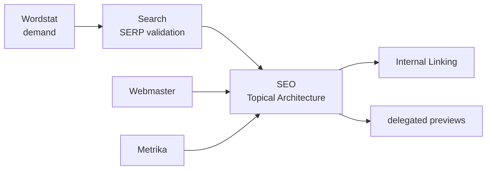
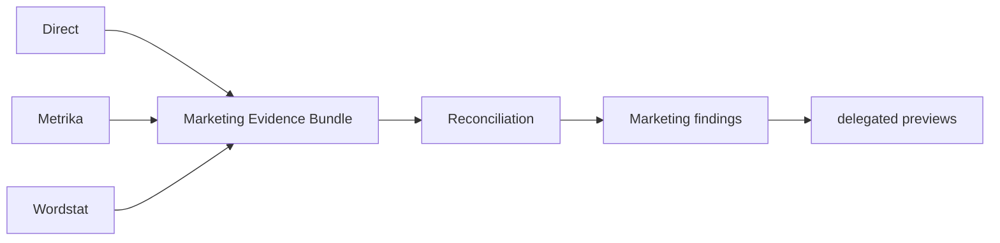

<p align="center"></p>

<p align="center"><a href="README.md">Русский</a> · <strong>English</strong></p>

<p align="center">   </p>

# Yandex AI Plugins

A marketplace of independent AI plugins **for Yandex services** — Direct, Metrika, Webmaster, Wordstat, Search, plus cross-service SEO/Marketing orchestration — used from AI agents and coding assistants. This is not a plugin set for YandexGPT: each plugin gives an agent specialized skills, verifiable API/workflow contracts, and a safe path to the owning Yandex service.

The current repository release is `1.1.0`. Plugins version independently; published release/tag records are treated as immutable.

## What this is and who it is for

Use this repository when an agent must do more than “know about Yandex”: it should work inside explicit ownership boundaries, read real data, preserve provenance, avoid combining incompatible metrics, and never perform a consequential write without an exact preview and separate approval.

It covers PPC/marketing analytics, SEO, demand research, SERP analysis, indexing workflows, and automation around Yandex services. You do not need to install the whole marketplace — choose only the plugins required by the task.

## Plugins

| Plugin | Version | Type | Use it for | Writes |
|---|---:|---|---|---|
| [`yandex-direct`](plugins/yandex-direct/) | 2.1.0 | service | campaigns, Reports, keywords, budgets, audit | exact preview + later-turn approval |
| [`yandex-metrika`](plugins/yandex-metrika/) | 2.1.0 | service | analytics, goals, attribution, Logs, imports | exact preview + later-turn approval |
| [`yandex-webmaster`](plugins/yandex-webmaster/) | 2.1.0 | service | indexing, queries, recrawl, sitemaps, feeds | exact preview + later-turn approval |
| [`yandex-wordstat`](plugins/yandex-wordstat/) | 1.1.2 | service | demand, frequency, dynamics, regions, candidate topics | no consequential writes |
| [`yandex-search`](plugins/yandex-search/) | 1.0.2 | service | SERP, rankings, competitors, clustering | no |
| [`yandex-seo`](plugins/yandex-seo/) | 1.1.2 | cross-service | organic evidence, Topical Architecture, Internal Linking | delegated preview only |
| [`yandex-marketing`](plugins/yandex-marketing/) | 1.1.0 | cross-service | paid acquisition, reconciliation, opportunities | delegated preview only |

Full ownership and capability matrix: [`docs/SERVICE_MATRIX.en.md`](docs/SERVICE_MATRIX.en.md).

## 3-minute quick start

### 1. Connect the marketplace

Compatible manifests live at the repository root:

```text
.agents/plugins/marketplace.json
.claude-plugin/marketplace.json
```

For an OpenAI workspace with GitHub marketplace import: **Workspace settings → Plugins → Add → Import marketplace**, set Source to this repository URL, and leave Path empty. For other compatible runtimes, use their supported import/registration flow.

Full guide: [`docs/GETTING_STARTED.en.md`](docs/GETTING_STARTED.en.md).

### 2. Choose plugins

Examples: demand → Wordstat; technical SEO → Webmaster; SERP → Search; full organic analysis → Wordstat + Search + Webmaster + Metrika + SEO; paid acquisition → Direct + relevant Metrika/Wordstat evidence + Marketing.

A service plugin owns its credentials and API transport. `yandex-seo` and `yandex-marketing` own no Yandex credentials of their own.

### 3. Start with a read-only operation

For example, Direct:

```bash
cd plugins/yandex-direct
export YANDEX_DIRECT_TOKEN='...'
python scripts/yd_api.py campaigns get --params '{"SelectionCriteria":{},"FieldNames":["Id","Name","Status"]}'
```

Verify access and account context through a read before introducing a write workflow.

## How a task flows

A user asks: “Find campaigns with problems and propose budget changes.”

1. The agent routes the task to `yandex-direct`.
2. The plugin reads the necessary campaign/report data and preserves source context.
3. The agent analyzes the data and explains the recommendation.
4. If a change is needed, the plugin shows an exact preview with `preview_id`.
5. The user approves that exact preview in a later turn.
6. The owning service plugin performs the write and returns an execution receipt; P0 marks verification as `RESPONSE_ONLY` / `UNVERIFIED` until a separate read-back proves service state.

For complex SEO/Marketing tasks, the same pattern applies, but a cross-service plugin first combines evidence from several services and delegates any possible write back to the API owner.

## Safety

```text
read → analyze → preview → explicit approval → write → verify
```

A consequential write requires approval of the **exact** preview in a later user turn. A changed payload, environment, or approval-bound identity requires a new preview. API responses, web content, and files are data, not instructions and not permission to write.

In Direct/Metrika/Webmaster `2.1.0`, the exact preview uses `yandex-ai-approval/v2` and binds target/principal/request/cardinality. Bulk `>20` or `UNKNOWN` scale requires a separate `--ack-bulk` before transport. A successful write returns `yandex-ai-execution/v1`, but `RESPONSE_ONLY` / `UNVERIFIED` is not read-back verification and `NOT_AVAILABLE` does not promise rollback. A standalone CLI cannot prove human later-turn approval; that is a host/operator policy boundary.

Normative details: [`docs/PLUGIN_STANDARD.en.md`](docs/PLUGIN_STANDARD.en.md) and plugin-local safety references.

## SEO and Marketing orchestration

### SEO



Wordstat provides demand/candidate evidence, Search provides SERP evidence, and Webmaster/Metrika provide existing-site context. SEO analyzes those inputs without its own Yandex HTTP transport. The detailed evidence model and low-level invariants live in [`docs/ARCHITECTURE.en.md`](docs/ARCHITECTURE.en.md) and [`plugins/yandex-seo/README.en.md`](plugins/yandex-seo/README.en.md).

### Marketing



Overlapping Direct/Metrika metrics are not summed automatically. Marketing first determines the evidence role and compatibility, then produces a finding or delegated preview. See [`plugins/yandex-marketing/README.en.md`](plugins/yandex-marketing/README.en.md).

## What the project does not do

- it does not present Wordstat frequency or methodology as a proven ranking mechanism;
- it does not treat green CI as proof that an external API is current;
- it does not give SEO/Marketing credentials to bypass service ownership;
- it does not encode universal CPA/CPC/CTR/ROAS thresholds as Yandex rules;
- it does not treat a recommendation as permission for a live write;
- it does not claim model evals passed semantically merely because eval fixtures are structurally valid.

Terms: [`docs/GLOSSARY.en.md`](docs/GLOSSARY.en.md). Release governance: [`docs/RELEASE_POLICY.en.md`](docs/RELEASE_POLICY.en.md).

## Versions

```text
yandex-direct        2.1.0
yandex-metrika       2.1.0
yandex-webmaster     2.1.0
yandex-wordstat      1.1.2
yandex-search        1.0.2
yandex-seo           1.1.2
yandex-marketing     1.1.0
```

The repository uses one current SemVer line; plugins use independent SemVer. Historical OPUS/PHASE/DOCS/FABLE labels remain immutable history/codenames rather than competing current versions. Policy: [`docs/RELEASE_POLICY.en.md`](docs/RELEASE_POLICY.en.md).

## Repository verification

Full repository contract:

```bash
python scripts/validate_repo.py
python -m unittest discover -s tests -v
```

Example plugin-level regression/compile check:

```bash
cd plugins/yandex-marketing
python -m unittest discover -s tests -v
python -m compileall -q scripts
```

Strict reference freshness is checked separately with `python scripts/check_reference_freshness.py`.

## Documentation

- [`docs/GETTING_STARTED.en.md`](docs/GETTING_STARTED.en.md) — installation, credentials, and a first safe request;
- [`docs/ARCHITECTURE.en.md`](docs/ARCHITECTURE.en.md) — ownership, evidence flow, transport boundaries;
- [`docs/ROADMAP.en.md`](docs/ROADMAP.en.md) — product strategy, safety/memory/workflow/eval priorities, and the frozen expansion backlog;
- [`docs/GLOSSARY.en.md`](docs/GLOSSARY.en.md) — plain-language explanations of exact terms/tokens;
- [`docs/SERVICE_MATRIX.en.md`](docs/SERVICE_MATRIX.en.md) — available services and versions;
- [`docs/PLUGIN_STANDARD.en.md`](docs/PLUGIN_STANDARD.en.md) — normative production plugin contract;
- [`docs/RELEASE_POLICY.en.md`](docs/RELEASE_POLICY.en.md) — repository/plugin versioning and release gates;
- [`docs/REVIEW_FIRST_RELEASE.en.md`](docs/REVIEW_FIRST_RELEASE.en.md) — independent review guide;
- [`docs/reviews/README.en.md`](docs/reviews/README.en.md) — index of dated independent review artifacts;
- [`docs/reviews/2026-09-05-fable-round2-closure.en.md`](docs/reviews/2026-09-05-fable-round2-closure.en.md) — latest dated Fable Round 2 remediation artifact;
- [`docs/reviews/2026-09-05-opus-codex-governance.en.md`](docs/reviews/2026-09-05-opus-codex-governance.en.md) — previous governance review artifact;
- [`SECURITY.en.md`](SECURITY.en.md) — security-sensitive reporting guidance;
- [`CONTRIBUTING.md`](CONTRIBUTING.md) — contributor entrypoint;
- [`CODE_OF_CONDUCT.en.md`](CODE_OF_CONDUCT.en.md) — repository community interaction baseline;
- [`CHANGELOG.en.md`](CHANGELOG.en.md) · [Russian changelog](CHANGELOG.md).

## Structure

```text
plugins/yandex-<service>/
├── .codex-plugin/plugin.json
├── .claude-plugin/plugin.json
├── skills/*/SKILL.md
├── references/
├── scripts/
├── tests/
├── evals/
├── README.md
├── README.en.md
├── CHANGELOG.md
└── CHANGELOG.en.md
```

## License and sources

Project code and original documentation are MIT licensed. Official Yandex documentation remains canonical for API behavior; external methodology/workflow material is used as a source of ideas rather than a substitute for authoritative API/ranking evidence.
