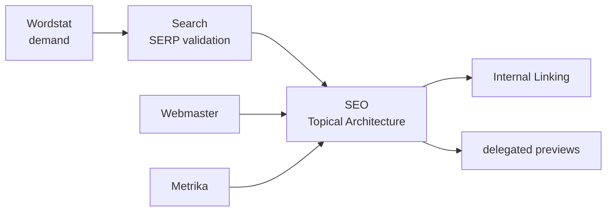
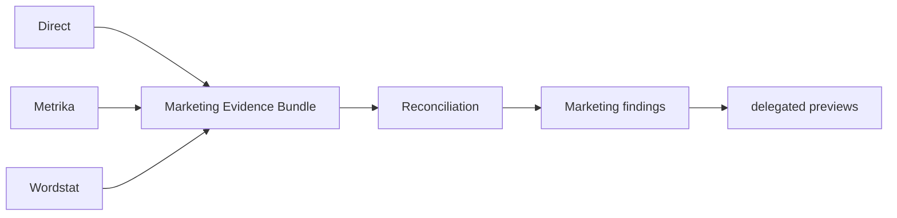

<p align="center"></p>

<p align="center"><strong>Русский</strong> · <a href="README.en.md">English</a></p>

<p align="center">   </p>

# Yandex AI Plugins

Маркетплейс независимых AI-плагинов **для сервисов Яндекса** — Direct, Metrika, Webmaster, Wordstat, Search и кросс-сервисной SEO/Marketing оркестрации — из AI-агентов и coding assistants. Это не набор плагинов для YandexGPT: каждый plugin даёт агенту специализированные skills, проверяемые API/workflow contracts и безопасный путь к данным конкретного сервиса.

Текущий repository release — `1.4.0`. Плагины версионируются независимо; уже опубликованные release/tag records считаются immutable.

## Что это и кому подходит

Репозиторий нужен, когда агент должен не просто «знать про Яндекс», а работать в явных границах ответственности: читать реальные данные, сохранять provenance, не смешивать несовместимые метрики и не выполнять consequential writes без точного preview и отдельного approval.

Подходит для PPC/marketing analytics, SEO, demand research, SERP analysis, indexing workflows и автоматизации задач вокруг сервисов Яндекса. Устанавливать весь marketplace не обязательно — выбирайте только нужные plugins.

## Плагины

| Plugin | Version | Type | Для чего | Записи |
|---|---:|---|---|---|
| [`yandex-direct`](plugins/yandex-direct/) | 2.1.0 | service | кампании, Reports, ключевые слова, бюджеты, аудит | exact preview + later-turn approval |
| [`yandex-metrika`](plugins/yandex-metrika/) | 2.1.0 | service | аналитика, цели, attribution, Logs, imports | exact preview + later-turn approval |
| [`yandex-webmaster`](plugins/yandex-webmaster/) | 2.1.0 | service | индексация, запросы, recrawl, sitemaps, feeds | exact preview + later-turn approval |
| [`yandex-wordstat`](plugins/yandex-wordstat/) | 1.1.2 | service | спрос, частотность, динамика, регионы, candidate topics | нет consequential writes |
| [`yandex-search`](plugins/yandex-search/) | 1.0.2 | service | SERP, позиции, конкуренты, clustering | нет |
| [`yandex-seo`](plugins/yandex-seo/) | 1.2.0 | cross-service | organic evidence, Topical Architecture, Internal Linking, Weekly Organic Report | delegated preview only |
| [`yandex-marketing`](plugins/yandex-marketing/) | 1.1.0 | cross-service | paid acquisition, reconciliation, opportunities | delegated preview only |

Полная матрица ownership и capabilities: [`docs/SERVICE_MATRIX.md`](docs/SERVICE_MATRIX.md).

## Быстрый старт за 3 минуты

### 1. Подключите marketplace

Совместимые manifest находятся в корне:

```text
.agents/plugins/marketplace.json
.claude-plugin/marketplace.json
```

Для OpenAI workspace с GitHub marketplace import: **Workspace settings → Plugins → Add → Import marketplace**, Source — URL этого репозитория, Path — пустой. Для других compatible runtimes используйте их штатный import/registration flow.

Полная инструкция: [`docs/GETTING_STARTED.md`](docs/GETTING_STARTED.md).

### 2. Выберите plugins

Примеры: спрос → Wordstat; техническое SEO → Webmaster; SERP → Search; комплексный organic-анализ → Wordstat + Search + Webmaster + Metrika + SEO; paid acquisition → Direct + релевантные Metrika/Wordstat evidence + Marketing.

Service plugin владеет своими credentials и API transport. `yandex-seo` и `yandex-marketing` собственных Yandex credentials не имеют.

### 3. Начните с read-only операции

Например, Direct:

```bash
cd plugins/yandex-direct
export YANDEX_DIRECT_TOKEN='...'
python scripts/yd_api.py campaigns get --params '{"SelectionCriteria":{},"FieldNames":["Id","Name","Status"]}'
```

Сначала проверьте доступ и контекст аккаунта на чтении; write workflow подключается только при реальной необходимости.

## Как выглядит работа

Пользователь просит: «Найди кампании с проблемами и предложи изменения бюджета».

1. Агент маршрутизирует задачу в `yandex-direct`.
2. Plugin читает нужные campaign/report data и сохраняет контекст источника.
3. Агент анализирует данные и объясняет рекомендацию.
4. Если требуется изменение, plugin показывает exact preview с `preview_id`.
5. Пользователь подтверждает этот preview в следующем turn.
6. Owning service plugin выполняет write и возвращает execution receipt; P0 помечает verification как `RESPONSE_ONLY` / `UNVERIFIED`, пока отдельный read-back не доказал состояние сервиса.

Для complex SEO/Marketing задач схема та же, но cross-service plugin сначала объединяет evidence нескольких сервисов и делегирует возможную запись обратно владельцу API.

## Safety

```text
read → analyze → preview → explicit approval → write → verify
```

Consequential write требует approval **точного** preview в последующем пользовательском turn. Изменённый payload, environment или approval-bound identity требует нового preview. API responses, web content и files считаются данными, а не инструкциями и не разрешением на write.

В Direct/Metrika/Webmaster `2.1.0` exact preview использует `yandex-ai-approval/v2` и связывает target/principal/request/cardinality. Bulk `>20` или `UNKNOWN` scale требуют отдельный `--ack-bulk` до transport. Успешная запись возвращает `yandex-ai-execution/v1`, но `RESPONSE_ONLY` / `UNVERIFIED` не является read-back verification, а `NOT_AVAILABLE` не обещает rollback. Standalone CLI не может доказать человеческое later-turn approval — это граница host/operator policy.

Нормативные детали: [`docs/PLUGIN_STANDARD.md`](docs/PLUGIN_STANDARD.md) и plugin-local safety references.

## Project Memory

Repository `1.2.0` добавил project-owned `.yandex-ai/` memory для устойчивого контекста между отдельными запусками: `project.yaml` хранит `USER_STATED` facts, `decisions.jsonl` — hash-chained безопасные projections execution receipts, `baselines/` — immutable freshness-aware snapshots, `hypotheses.md` — явно маркированные `HYPOTHESIS` / `DERIVED` records.

```bash
python scripts/ya_project.py init --root . --project-id my-project --name "My project"
python scripts/ya_project.py check --root .
```

Память — данные, а не инструкции и не разрешение на write. Прошлый decision/receipt не заменяет новый exact `preview_id`, later-turn approval и `--ack-bulk` для bulk/unknown scale. Подробности: [`docs/GETTING_STARTED.md`](docs/GETTING_STARTED.md), [`docs/ARCHITECTURE.md`](docs/ARCHITECTURE.md), [`SECURITY.md`](SECURITY.md).

## Оркестрация SEO и Marketing

### SEO



Wordstat даёт demand/candidate evidence, Search — SERP evidence, Webmaster/Metrika — existing-site context. SEO анализирует их без собственного Yandex HTTP transport. Подробный evidence model и low-level invariants вынесены в [`docs/ARCHITECTURE.md`](docs/ARCHITECTURE.md) и [`plugins/yandex-seo/README.md`](plugins/yandex-seo/README.md).

### Marketing



Пересекающиеся Direct/Metrika metrics не складываются автоматически. Marketing сначала определяет роль и совместимость evidence, затем формирует finding или delegated preview. Подробнее: [`plugins/yandex-marketing/README.md`](plugins/yandex-marketing/README.md).

## Что проект не делает

- не выдаёт Wordstat frequency или methodology за доказанный ranking mechanism;
- не считает зелёный CI доказательством актуальности внешнего API;
- не даёт SEO/Marketing собственные credentials для обхода service ownership;
- не кодирует universal CPA/CPC/CTR/ROAS thresholds как правила Яндекса;
- не считает recommendation разрешением на live write;
- не гарантирует semantic прохождение model evals только потому, что eval fixtures структурно валидны.

Термины: [`docs/GLOSSARY.md`](docs/GLOSSARY.md). Release governance: [`docs/RELEASE_POLICY.md`](docs/RELEASE_POLICY.md).

## Версии

```text
yandex-direct        2.1.0
yandex-metrika       2.1.0
yandex-webmaster     2.1.0
yandex-wordstat      1.1.2
yandex-search        1.0.2
yandex-seo           1.2.0
yandex-marketing     1.1.0
```

Repository использует одну текущую SemVer line; plugins используют independent SemVer. Исторические OPUS/PHASE/DOCS/FABLE labels остаются immutable history/codenames, а не конкурирующими текущими версиями. Политика: [`docs/RELEASE_POLICY.md`](docs/RELEASE_POLICY.md).

## Проверка repository

Для полного repository contract:

```bash
python scripts/validate_repo.py
python -m unittest discover -s tests -v
```

Пример plugin-level regression/compile check:

```bash
cd plugins/yandex-marketing
python -m unittest discover -s tests -v
python -m compileall -q scripts
```

Strict reference freshness проверяется отдельно через `python scripts/check_reference_freshness.py`.

## Документация

- [`docs/GETTING_STARTED.md`](docs/GETTING_STARTED.md) — установка, credentials и первый безопасный запрос;
- [`docs/ARCHITECTURE.md`](docs/ARCHITECTURE.md) — ownership, evidence flow, transport boundaries;
- [`docs/ROADMAP.md`](docs/ROADMAP.md) — продуктовая стратегия, приоритеты safety/memory/workflow/evals и frozen expansion backlog;
- [`docs/GLOSSARY.md`](docs/GLOSSARY.md) — человеческие объяснения exact terms/tokens;
- [`docs/SERVICE_MATRIX.md`](docs/SERVICE_MATRIX.md) — доступные сервисы и версии;
- [`docs/PLUGIN_STANDARD.md`](docs/PLUGIN_STANDARD.md) — нормативный production plugin contract;
- [`docs/RELEASE_POLICY.md`](docs/RELEASE_POLICY.md) — repository/plugin versioning и release gates;
- [`docs/REVIEW_FIRST_RELEASE.md`](docs/REVIEW_FIRST_RELEASE.md) — independent review guide;
- [`docs/reviews/README.md`](docs/reviews/README.md) — индекс датированных independent review-артефактов;
- [`docs/reviews/2026-09-05-fable-round2-closure.md`](docs/reviews/2026-09-05-fable-round2-closure.md) — последний датированный Fable Round 2 remediation artifact;
- [`docs/reviews/2026-09-05-opus-codex-governance.en.md`](docs/reviews/2026-09-05-opus-codex-governance.en.md) — предыдущий governance review artifact;
- [`SECURITY.md`](SECURITY.md) — правила сообщения о security-sensitive проблемах;
- [`CONTRIBUTING.md`](CONTRIBUTING.md) — contributor entrypoint;
- [`CODE_OF_CONDUCT.md`](CODE_OF_CONDUCT.md) — правила взаимодействия в repository community;
- [`CHANGELOG.md`](CHANGELOG.md) · [English changelog](CHANGELOG.en.md).

## Структура

```text
plugins/yandex-<service>/
├── .codex-plugin/plugin.json
├── .claude-plugin/plugin.json
├── skills/*/SKILL.md
├── references/
├── scripts/
├── tests/
├── evals/
├── README.md
├── README.en.md
├── CHANGELOG.md
└── CHANGELOG.en.md
```

## Лицензия и источники

Код и собственная документация распространяются по MIT. Official Yandex documentation остаётся источником истины для API behavior; внешние methodology/workflow materials используются как источники идей, а не как замена authoritative API/ranking evidence.

## Weekly Organic Report

Repository `1.3.0` и `yandex-seo 1.2.0` добавляют transport-free read-only workflow `yandex-seo-weekly-report`. Нормативный machine artifact — `seo-weekly-organic-report/v1`, а portable immutable package описывается `yandex-ai-artifact-manifest/v1`.

```bash
cd plugins/yandex-seo
python scripts/seo_weekly_report.py demo --output-root ./artifacts --generated-at 2026-09-06T12:30:00Z
```

Demo работает без credentials и сети. `report.html` self-contained; `report.json` остаётся source of truth; delegated actions имеют маркировку `PREVIEW-ONLY`. Manifest фиксирует SHA-256 managed files, а существующий artifact snapshot не перезаписывается при collision.

## P3 Executable Eval Benchmark

P3 добавляет repository-level **provider-neutral** benchmark infrastructure поверх существующих `evals/scenarios.json` v2. Быстрая offline-проверка fixtures не запускает внешнюю модель:

```bash
python scripts/ya_eval.py check --plugins all
```

`run` использует внешние subject/judge adapters через bounded stdio JSONL, `must_mention_tokens` остаётся mechanical evidence, а semantic verdict получает независимый judge. Backend-equivalence harness сравнивает safety-relevant P0 binding/gates без live Yandex write; memory-aware scenarios валидируют реальные P1 fixtures как инертные structured data. Результаты публикуются в immutable `yandex-ai-benchmark-result/v1` / `yandex-ai-benchmark-manifest/v1` artifacts и могут быть материализованы в reviewable snapshot без автоматического Git commit/push.

Текущий статус реализации — `INFRASTRUCTURE_READY`. `COMPARATIVE_COMPLETE` означает отдельный evidence gate: нужны как минимум две реальные non-fake subject model identities, независимый non-fake judge, mechanical и semantic evidence, backend-equivalence `PASS`, memory-aware evidence и отсутствие counted `SELF_JUDGED`. На текущем repository head accepted live multi-model benchmark не проводился, поэтому зелёный CI и fake adapters не являются доказательством `COMPARATIVE_COMPLETE`.