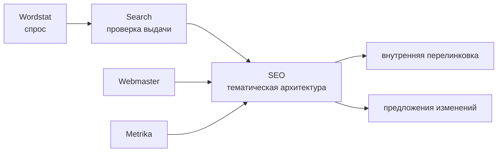
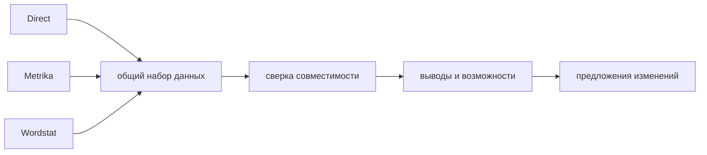

<p align="center"></p>

<p align="center"><strong>Русский</strong> · <a href="README.en.md">English</a></p>

<p align="center">   </p>

# Yandex AI Plugins

Маркетплейс независимых AI-плагинов **для сервисов Яндекса**: Директа, Метрики, Вебмастера, Wordstat, Поиска и межсервисной оркестрации SEO/Marketing.

Плагины дают AI-агентам специализированные навыки, доступ к данным конкретных сервисов и единые правила безопасной работы. Это не набор дополнений для YandexGPT: каждый плагин отвечает за свою предметную область и работает в явных границах доступа.

Текущая версия репозитория — `1.4.1`. Версии плагинов развиваются независимо.

## Что это и кому подходит

Репозиторий нужен, когда AI-агент должен не просто «знать про Яндекс», а выполнять практические задачи на реальных данных: анализировать рекламу и трафик, исследовать спрос, проверять индексацию, работать с поисковой выдачей, собирать SEO-картину и готовить безопасные изменения.

Основные сценарии:

- контекстная реклама и аналитика эффективности;
- веб-аналитика и цели;
- техническое SEO и индексация;
- исследование спроса и семантики;
- анализ поисковой выдачи и конкурентов;
- комплексные SEO- и маркетинговые задачи через несколько сервисов Яндекса.

Устанавливать весь набор необязательно: можно подключить только те плагины, которые нужны для конкретного проекта.

## Плагины

| Плагин | Версия | Тип | Основные задачи | Изменение данных |
|---|---:|---|---|---|
| [`yandex-direct`](plugins/yandex-direct/) | 2.1.0 | сервисный | кампании, отчёты, ключевые слова, бюджеты, аудит | только после точного предварительного просмотра и отдельного подтверждения |
| [`yandex-metrika`](plugins/yandex-metrika/) | 2.1.0 | сервисный | аналитика, цели, атрибуция, Logs API, импорты | только после точного предварительного просмотра и отдельного подтверждения |
| [`yandex-webmaster`](plugins/yandex-webmaster/) | 2.1.0 | сервисный | индексация, запросы, переобход, карты сайта, фиды | только после точного предварительного просмотра и отдельного подтверждения |
| [`yandex-wordstat`](plugins/yandex-wordstat/) | 1.1.2 | сервисный | спрос, частотность, динамика, регионы, темы | нет опасных операций записи |
| [`yandex-search`](plugins/yandex-search/) | 1.0.2 | сервисный | поисковая выдача, позиции, конкуренты, кластеризация | нет |
| [`yandex-seo`](plugins/yandex-seo/) | 1.2.0 | межсервисный | органические данные, тематическая архитектура, внутренняя перелинковка, еженедельный отчёт | только формирует предложения и передаёт запись сервисному плагину |
| [`yandex-marketing`](plugins/yandex-marketing/) | 1.1.0 | межсервисный | платное привлечение, сверка данных, поиск возможностей | только формирует предложения и передаёт запись сервисному плагину |

Полная матрица возможностей и зон ответственности: [`docs/SERVICE_MATRIX.md`](docs/SERVICE_MATRIX.md).

## Основные возможности

### Безопасные изменения

Для операций, которые изменяют данные в сервисах Яндекса, действует единая последовательность:

```text
чтение → анализ → предварительный просмотр → подтверждение → запись → проверка
```

Direct, Metrika и Webmaster не выполняют значимое изменение сразу по рекомендации агента. Сначала формируется точный предварительный просмотр операции с `preview_id`, затем пользователь отдельно подтверждает именно его. Если запрос, цель операции или контекст изменились, требуется новый предварительный просмотр.

Для крупных или заранее неизвестных объёмов действует дополнительное подтверждение `--ack-bulk`. После выполнения создаётся квитанция `yandex-ai-execution/v1`.

Важно: успешный ответ API ещё не означает, что состояние сервиса было независимо перечитано и проверено. Поэтому текущая возможность проверки честно обозначается как `RESPONSE_ONLY` / `UNVERIFIED`, а недоступный откат — как `NOT_AVAILABLE`.

Подробный нормативный контракт: [`docs/PLUGIN_STANDARD.md`](docs/PLUGIN_STANDARD.md).

### Память проекта

В репозитории есть проектная память `.yandex-ai/`, которая помогает сохранять устойчивый контекст между отдельными запусками агента:

- `project.yaml` — сведения о проекте и факты, явно сообщённые пользователем;
- `decisions.jsonl` — безопасная история выполненных решений;
- `baselines/` — неизменяемые снимки исходного состояния с контролем актуальности;
- `hypotheses.md` — гипотезы и производные выводы с явной маркировкой происхождения.

```bash
python scripts/ya_project.py init --root . --project-id my-project --name "My project"
python scripts/ya_project.py check --root .
```

Память хранит данные, но не выдаёт разрешений. Старое подтверждение или старая квитанция никогда не заменяют новое подтверждение конкретной операции.

Подробнее: [`docs/GETTING_STARTED.md`](docs/GETTING_STARTED.md) и [`docs/ARCHITECTURE.md`](docs/ARCHITECTURE.md).

### Еженедельный отчёт по органике

`yandex-seo` умеет собирать переносимый еженедельный отчёт по органическому поиску из совместимых данных Webmaster и Metrika. Он не требует собственного доступа SEO-плагина к API Яндекса и может работать на заранее подготовленных входных данных.

```bash
cd plugins/yandex-seo
python scripts/seo_weekly_report.py demo --output-root ./artifacts --generated-at 2026-09-06T12:30:00Z
```

В набор результата входят машиночитаемый `report.json`, автономный `report.html` и манифест с SHA-256. Уже созданный снимок не перезаписывается при конфликте, а возможные действия остаются только предложениями (`PREVIEW-ONLY`).

Подробнее: [`plugins/yandex-seo/README.md`](plugins/yandex-seo/README.md).

### Оценка качества моделей

Репозиторий содержит исполняемую инфраструктуру для проверки того, как разные AI-модели проходят одинаковые сценарии плагинов.

Быстрая локальная проверка сценариев не вызывает внешние модели:

```bash
python scripts/ya_eval.py check --plugins all
```

Полный прогон может использовать внешние модели-исполнители и независимую модель-судью, отдельно фиксируя механические проверки, смысловую оценку, эквивалентность способов подключения и поведение с памятью проекта.

Текущий доказанный статус — **инфраструктура готова** (`INFRASTRUCTURE_READY`). Итоговое сравнительное состояние (`COMPARATIVE_COMPLETE`) ещё не заявлено: для него нужны реальные прогоны как минимум двух разных моделей и независимой модели-судьи на рабочих сценариях. Зелёный CI и тестовые адаптеры сами по себе этого не доказывают.

Это как раз следующий практический этап проекта после завершения инженерной части.

## Быстрый старт за 3 минуты

### 1. Подключите маркетплейс

Совместимые манифесты находятся в корне репозитория:

```text
.agents/plugins/marketplace.json
.claude-plugin/marketplace.json
```

Для OpenAI Workspace с импортом GitHub-маркетплейса: **Workspace settings → Plugins → Add → Import marketplace**. В качестве Source укажите URL этого репозитория, поле Path оставьте пустым.

Для других совместимых сред используйте их штатный механизм импорта или регистрации плагинов.

Полная инструкция: [`docs/GETTING_STARTED.md`](docs/GETTING_STARTED.md).

### 2. Выберите нужные плагины

Примеры:

- исследование спроса → Wordstat;
- техническое SEO → Webmaster;
- анализ выдачи → Search;
- комплексный органический анализ → Wordstat + Search + Webmaster + Metrika + SEO;
- платное привлечение → Direct + релевантные данные Metrika/Wordstat + Marketing.

Сервисный плагин сам отвечает за свои учётные данные и транспорт к API. `yandex-seo` и `yandex-marketing` собственных учётных данных Яндекса не имеют.

### 3. Начните с операции чтения

Например, для Директа:

```bash
cd plugins/yandex-direct
export YANDEX_DIRECT_TOKEN='...'
python scripts/yd_api.py campaigns get --params '{"SelectionCriteria":{},"FieldNames":["Id","Name","Status"]}'
```

Сначала убедитесь, что агент видит нужный аккаунт и корректно читает данные. Возможность записи стоит подключать только там, где она действительно нужна.

## Как проходит рабочая задача

Пользователь просит: «Найди кампании с проблемами и предложи изменения бюджета».

1. Агент передаёт задачу в `yandex-direct`.
2. Плагин получает нужные данные кампаний и отчётов и сохраняет сведения об источнике.
3. Агент анализирует данные и объясняет рекомендацию.
4. Если требуется изменение, плагин показывает точный предварительный просмотр с `preview_id`.
5. Пользователь подтверждает именно этот вариант в следующем сообщении.
6. Сервисный плагин выполняет операцию и возвращает квитанцию выполнения.
7. Если доступна отдельная проверка чтением, фактическое состояние сервиса подтверждается независимо.

Для комплексных SEO/Marketing-задач межсервисный плагин сначала объединяет данные нескольких сервисов, а возможную запись передаёт обратно тому сервисному плагину, который владеет соответствующим API.

## Оркестрация SEO и Marketing

### SEO



Wordstat даёт данные о спросе, Search — сведения о поисковой выдаче, Webmaster и Metrika — контекст существующего сайта. SEO объединяет их, не получая собственного транспорта к API Яндекса.

Подробнее: [`docs/ARCHITECTURE.md`](docs/ARCHITECTURE.md) и [`plugins/yandex-seo/README.md`](plugins/yandex-seo/README.md).

### Marketing



Пересекающиеся показатели Direct и Metrika не складываются автоматически. Сначала определяется роль каждого источника и совместимость данных, затем формируется вывод или предложение изменения.

Подробнее: [`plugins/yandex-marketing/README.md`](plugins/yandex-marketing/README.md).

## Ограничения и принципы

Проект сознательно не делает следующих утверждений:

- частотность Wordstat или внешняя методология не выдаются за доказанный механизм ранжирования;
- зелёный CI не считается доказательством актуальности внешнего API;
- SEO и Marketing не получают собственные учётные данные для обхода владельца сервисного API;
- универсальные пороги CPA/CPC/CTR/ROAS не выдаются за правила Яндекса;
- рекомендация агента не считается разрешением на изменение данных;
- структурно корректные тестовые сценарии не считаются доказательством качественной работы реальных моделей.

Термины и точные технические обозначения: [`docs/GLOSSARY.md`](docs/GLOSSARY.md).

## Версии

```text
yandex-direct        2.1.0
yandex-metrika       2.1.0
yandex-webmaster     2.1.0
yandex-wordstat      1.1.2
yandex-search        1.0.2
yandex-seo           1.2.0
yandex-marketing     1.1.0
```

Репозиторий использует одну текущую линию SemVer, а каждый плагин — собственную. Исторические обозначения OPUS, PHASE, DOCS и FABLE остаются именами этапов и не образуют отдельную систему версий.

Политика релизов: [`docs/RELEASE_POLICY.md`](docs/RELEASE_POLICY.md).

## Проверка репозитория

Полная проверка контрактов и тестов:

```bash
python scripts/validate_repo.py
python -m unittest discover -s tests -v
```

Пример проверки отдельного плагина:

```bash
cd plugins/yandex-marketing
python -m unittest discover -s tests -v
python -m compileall -q scripts
```

Актуальность внешних справочных ссылок проверяется отдельно:

```bash
python scripts/check_reference_freshness.py
```

## Документация

- [`docs/GETTING_STARTED.md`](docs/GETTING_STARTED.md) — установка, учётные данные и первый безопасный запрос;
- [`docs/ARCHITECTURE.md`](docs/ARCHITECTURE.md) — архитектура, зоны ответственности и потоки данных;
- [`docs/ROADMAP.md`](docs/ROADMAP.md) — продуктовая стратегия и дальнейшие этапы;
- [`docs/GLOSSARY.md`](docs/GLOSSARY.md) — объяснение точных терминов и технических токенов;
- [`docs/SERVICE_MATRIX.md`](docs/SERVICE_MATRIX.md) — доступные сервисы и версии;
- [`docs/PLUGIN_STANDARD.md`](docs/PLUGIN_STANDARD.md) — нормативный контракт плагина;
- [`docs/RELEASE_POLICY.md`](docs/RELEASE_POLICY.md) — версии и правила публикации;
- [`docs/REVIEW_FIRST_RELEASE.md`](docs/REVIEW_FIRST_RELEASE.md) — порядок независимого ревью;
- [`docs/reviews/README.md`](docs/reviews/README.md) — архив датированных материалов ревью;
- [`SECURITY.md`](SECURITY.md) — правила сообщения о проблемах безопасности;
- [`CONTRIBUTING.md`](CONTRIBUTING.md) — как участвовать в разработке;
- [`CODE_OF_CONDUCT.md`](CODE_OF_CONDUCT.md) — правила взаимодействия;
- [`CHANGELOG.md`](CHANGELOG.md) · [English changelog](CHANGELOG.en.md).

## Структура

```text
plugins/yandex-<service>/
├── .codex-plugin/plugin.json
├── .claude-plugin/plugin.json
├── skills/*/SKILL.md
├── references/
├── scripts/
├── tests/
├── evals/
├── README.md
├── README.en.md
├── CHANGELOG.md
└── CHANGELOG.en.md
```

## Лицензия и источники

Код и собственная документация распространяются по лицензии MIT.

Официальная документация Яндекса остаётся основным источником истины для поведения API. Внешние методические материалы используются как источник идей и практик, но не подменяют официальные API-контракты и не считаются самостоятельным доказательством факторов ранжирования.