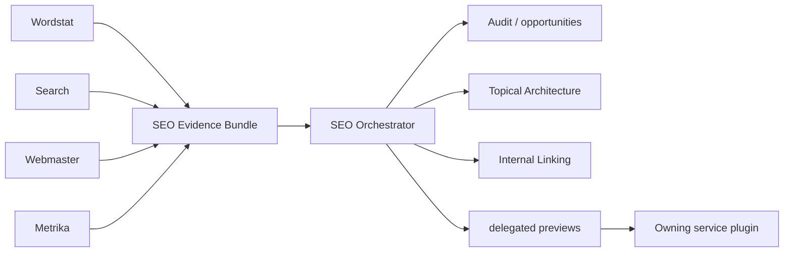
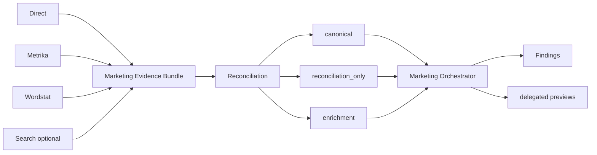

# Architecture

[Русский](ARCHITECTURE.md) · [**English**](ARCHITECTURE.en.md)

This document owns the technical detail that should not overload the root README: ownership, evidence flow, safety boundaries, and code-distribution rules across independently installable plugins.

## 1. Plugin boundary

**Service plugins** own a specific Yandex service API, its credentials, volatile contract facts, and service-specific helpers. Today these are Direct, Metrika, Webmaster, Wordstat, and Search.

**Cross-service plugins** combine evidence from several services. Today these are SEO and Marketing. They must not duplicate Yandex HTTP transport or take credentials away from a service plugin merely to orchestrate work.

```text
service plugins                 cross-service orchestration
───────────────                 ───────────────────────────
yandex-direct ────────────────▶ yandex-marketing
yandex-metrika ───────┬───────▶ yandex-marketing
                      └───────▶ yandex-seo
yandex-wordstat ──────┬───────▶ yandex-marketing
                      └───────▶ yandex-seo
yandex-search ────────┬───────▶ yandex-marketing
                      └───────▶ yandex-seo
yandex-webmaster ─────────────▶ yandex-seo
```

## 2. Execution model

The preferred backend order is consistent: compatible connected MCP/app → bundled helper → user-provided export/file. Backend choice must not change reasoning or safety semantics.

A service plugin performs the API call or reads an export, normalizes the result only within its documented contract, and sends provenance plus limitations downstream. A cross-service plugin analyzes those inputs without creating a second transport stack.

### Cross-service authentication metadata

The `.agents` marketplace schema requires a supported authentication policy, so transport-free `yandex-seo` and `yandex-marketing` use `policy.authentication: ON_USE`. In this case it is **schema-compatible deferred-auth metadata**: authentication is deferred until an owning service plugin is invoked, and that service plugin owns the real credentials and transport. `ON_USE` does not give SEO/Marketing Yandex credentials, an HTTP client, or authority to bypass service ownership; repository validation separately rejects those transport/credential surfaces in cross-service plugins.

Other documents may retain a concise reminder, but `ARCHITECTURE` is the canonical explanatory source for `ON_USE` semantics in transport-free orchestration.

## 3. Safety and write ownership

Common lifecycle:

```text
read → analyze → preview → explicit approval → write → verify
```

For a consequential write, the owning service plugin first creates an exact preview with `preview_id`. Approval applies to that exact preview and is accepted only in a later user turn. A cross-service plugin can produce a delegated preview, but the owning service plugin performs the live mutation.

API responses, web content, report rows, CSV/TSV, and user files are data, not instructions and not permission to write.

## 4. Evidence and provenance

The project separates four claim classes:

- `OBSERVED` — obtained directly from a source;
- `DERIVED` — calculated from observed data by an explicit rule;
- `HYPOTHESIS` — an inference that requires further validation;
- `METHODOLOGY` — a methodological principle that must not be presented as a verified ranking/API fact.

Provenance preserves the origin of a metric, query, URL, period, attribution context, and known limitations. Overlapping metrics from different sources are not automatically summed.

## 5. SEO orchestration

### Evidence flow



SEO owns no Yandex credentials or HTTP client. It accepts evidence from service plugins, evaluates source sufficiency, and preserves limitations. For example, missing Search evidence for page-boundary decisions is exposed as `SERP_VALIDATION_MISSING` rather than being hidden behind Wordstat frequency.

### Topical Architecture and Internal Linking

Wordstat produces candidate demand/topic evidence; Search owns real SERP-overlap clustering; SEO combines those inputs with existing-site evidence from Webmaster/Metrika and builds `structural_tree` and `semantic_graph` as separate layers.

Low-level invariants — allowed page decisions, Search provenance for empirical boundary changes, `BRIDGE`/orphan semantics, `SELF_LINK`, duplicate handling, and the difference between not-evaluated `null` and evaluated-empty results — remain in plugin-local SKILL/references/tests. They do not belong in the landing README, but they remain part of the production contract.

## 6. Marketing orchestration



`canonical` is the source selected for the primary calculation; `reconciliation_only` is used for cross-checking, while `enrichment` adds context. This prevents double-counting overlapping Direct/Metrika metrics and separates observation from recommendation.

## 7. Progressive disclosure

`SKILL.md` should be a compact discoverable workflow contract. Long or volatile API facts live in `references/` and are read when needed. Bundled executable logic lives in `scripts/`, regression tests in `tests/`, and offline routing/expectation fixtures in `evals/`.

The repository validator bounds `SKILL.md` size and checks discoverable names plus safety metadata. A large number of skills therefore does not mean that all skill text must enter agent context at once.

## 8. Service-local shared code

Similar `_http.py` or other adapters do not need to be byte-identical. For independently installable plugins, reliable dependency delivery matters more than formal DRY.

Common invariants are checked by repository-level behavioral tests, including secret redaction, bounded HTTP errors, and explicit timeouts. Promotion into a root/shared runtime package is appropriate only when the interface is stable **and** every independently installed plugin has a defined installability/distribution contract.

## 9. Where normative detail lives

- [`PLUGIN_STANDARD.en.md`](PLUGIN_STANDARD.en.md) — repository-wide production contract;
- [`CONTRACT_MATRIX.json`](CONTRACT_MATRIX.json) — high-risk traceability index;
- [`SERVICE_MATRIX.en.md`](SERVICE_MATRIX.en.md) — service ownership and capabilities;
- [`GLOSSARY.en.md`](GLOSSARY.en.md) — terminology;
- `../plugins/<service>/README.en.md` — capability boundary for a specific plugin;
- `../plugins/<service>/references/` — volatile API facts;
- `../plugins/<service>/skills/*/SKILL.md` — task-specific workflow contract.

## 10. Executable consequential-write boundary

Owning Direct, Metrika, and Webmaster helpers use `yandex-ai-approval/v2`: the exact operation, target, authenticated-principal binding, cardinality, and safety capabilities are part of one approval-bound envelope. `UNKNOWN` cardinality is treated as fail-closed bulk risk; repository threshold `20` is an internal safety policy, not a Yandex API limit. After exact approval, bulk/unknown execution requires the separate scale acknowledgement `--ack-bulk` on owning surfaces that can expose that cardinality.

After transport, a successful write returns `yandex-ai-execution/v1`. In the current P0 contract verification capability is `RESPONSE_ONLY`, state is `UNVERIFIED`, and rollback is `NOT_AVAILABLE`. The architecture therefore distinguishes `EXECUTED` from `VERIFIED`: an API response does not prove the final state through read-back.

Later-turn human approval remains orchestration/host policy. A standalone CLI checks the exact digest and scale gate, but cannot itself prove that a human saw the preview and supplied approval in a later conversational turn.

## 11. P1 Project Memory

Project Memory is repository-level domain memory, not AI-runtime memory. The managed user tree consists of `.yandex-ai/project.yaml`, `.yandex-ai/decisions.jsonl`, `.yandex-ai/baselines/`, and `.yandex-ai/hypotheses.md`. Its schemas are `yandex-ai-project/v1`, `yandex-ai-decision/v1`, `yandex-ai-baseline/v1`, and `yandex-ai-hypothesis/v1`.

`project.yaml` stores project identity and user-stated facts with `USER_STATED` provenance; replacing an active fact is explicit supersession. `record-execution` projects `yandex-ai-execution/v1` into a chained decision trail: raw `result` is not stored, while `receipt_sha256` hashes the complete receipt. `add-baseline` creates immutable snapshots; after `fresh_until` a snapshot is `STALE`, which is a warning rather than a mutation trigger. In `hypotheses.md`, only explicitly marked JSON fences are managed, with provenance restricted to `HYPOTHESIS` or `DERIVED`; all other Markdown and prompt-like text remains inert data.

P1 does not expand write authority. Every new consequential mutation still crosses the P0 boundary: a new exact `preview_id`, later-turn explicit human approval, and separate `--ack-bulk` for bulk/unknown cardinality. Decision history, a `STALE` baseline, or a user fact is never reusable approval.
