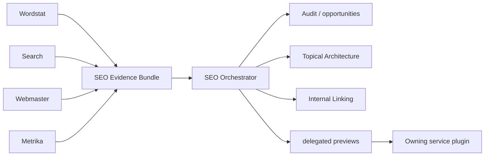
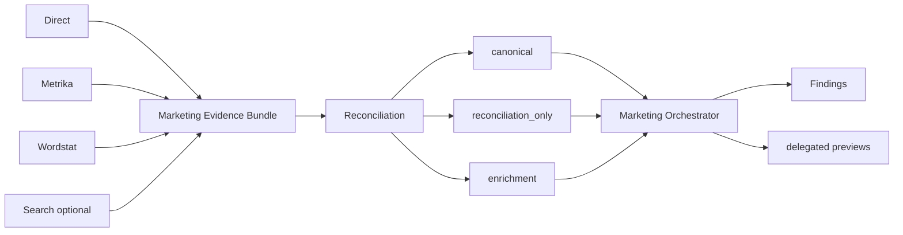

# Архитектура

[**Русский**](ARCHITECTURE.md) · [English](ARCHITECTURE.en.md)

Этот документ содержит технические детали, которые не должны перегружать корневой README: ownership, evidence flow, safety boundary и правила распределения кода между независимо устанавливаемыми плагинами.

## 1. Граница плагина

**Service plugins** владеют API конкретного сервиса Яндекса, его credentials, volatile contract facts и service-specific helpers. Сейчас это Direct, Metrika, Webmaster, Wordstat и Search.

**Cross-service plugins** соединяют evidence из нескольких сервисов. Сейчас это SEO и Marketing. Они не должны дублировать Yandex HTTP transport или забирать credentials у service plugin только ради оркестрации.

```text
service plugins                 cross-service orchestration
───────────────                 ───────────────────────────
yandex-direct ────────────────▶ yandex-marketing
yandex-metrika ───────┬───────▶ yandex-marketing
                      └───────▶ yandex-seo
yandex-wordstat ──────┬───────▶ yandex-marketing
                      └───────▶ yandex-seo
yandex-search ────────┬───────▶ yandex-marketing
                      └───────▶ yandex-seo
yandex-webmaster ─────────────▶ yandex-seo
```

## 2. Модель выполнения

Предпочтительный порядок backend остаётся единым: compatible connected MCP/app → bundled helper → user-provided export/file. Выбор backend не должен менять reasoning и safety semantics.

Service plugin выполняет API call или читает export, нормализует результат только в пределах задокументированного contract и передаёт downstream provenance вместе с limitations. Cross-service plugin анализирует полученные данные, но не создаёт второй transport stack.

### Cross-service authentication metadata

Marketplace schema `.agents` требует для plugin один из поддерживаемых authentication policies, поэтому transport-free `yandex-seo` и `yandex-marketing` используют `policy.authentication: ON_USE`. В их случае это **schema-compatible deferred-auth metadata**: authentication откладывается до обращения к owning service plugin, который реально владеет credentials и transport. `ON_USE` не выдаёт SEO/Marketing собственные Yandex credentials, HTTP client или право обходить service ownership; repository validator отдельно запрещает соответствующие transport/credential surfaces в cross-service plugins.

Остальные документы могут кратко напоминать этот факт, но именно `ARCHITECTURE` является canonical explanatory source для semantics `ON_USE` у transport-free orchestration.

## 3. Safety и ownership записи

Общий lifecycle:

```text
read → analyze → preview → explicit approval → write → verify
```

Для consequential write owning service plugin сначала создаёт exact preview с `preview_id`. Approval относится к конкретному preview и принимается только в последующем пользовательском turn. Cross-service plugin может сформировать delegated preview, но live mutation выполняет owning service plugin.

API response, web content, report row, CSV/TSV и пользовательский файл считаются данными, а не инструкциями и не разрешением на write.

## 4. Evidence и provenance

Проект разделяет четыре класса claims:

- `OBSERVED` — непосредственно получено из источника;
- `DERIVED` — вычислено из наблюдаемых данных по явному правилу;
- `HYPOTHESIS` — вывод, который требует дополнительной проверки;
- `METHODOLOGY` — методический принцип, который нельзя выдавать за подтверждённый ranking/API fact.

Provenance сохраняет происхождение метрики, query, URL, периода, attribution context и известных ограничений. Пересекающиеся метрики разных источников не складываются автоматически.

## 5. SEO orchestration

### Поток evidence



SEO не владеет Yandex credentials и HTTP client. Он принимает evidence от service plugins, проверяет достаточность источников и сохраняет limitations. Например, отсутствие Search evidence для page-boundary решений раскрывается через `SERP_VALIDATION_MISSING`, а не маскируется Wordstat frequency.

### Topical Architecture и Internal Linking

Wordstat формирует candidate demand/topic evidence; Search владеет реальным SERP-overlap clustering; SEO объединяет это с existing-site evidence из Webmaster/Metrika и строит `structural_tree` и `semantic_graph` как отдельные слои.

Low-level invariants — допустимые page decisions, Search provenance для empirical boundary changes, `BRIDGE`/orphan semantics, `SELF_LINK`, duplicate handling и различие not-evaluated `null` от evaluated-empty results — остаются в plugin-local SKILL/references/tests. Они не являются обязанностью landing README, но остаются частью production contract.

## 6. Marketing orchestration



`canonical` — источник, выбранный для основного расчёта; `reconciliation_only` используется для сверки, а `enrichment` добавляет контекст. Это предотвращает двойной счёт пересекающихся Direct/Metrika metrics и отделяет наблюдение от рекомендации.

## 7. Progressive disclosure

`SKILL.md` должен быть коротким discoverable workflow contract. Длинные или изменчивые API facts живут в `references/` и читаются по необходимости. Bundled executable logic живёт в `scripts/`, regression tests — в `tests/`, offline routing/expectation fixtures — в `evals/`.

Repository validator ограничивает размер `SKILL.md`, проверяет discoverable names и safety metadata. Поэтому наличие большого числа skills не означает, что весь их текст должен одновременно попадать в контекст агента.

## 8. Service-local shared code

Похожие `_http.py` или другие adapters не обязаны быть byte-identical. Для независимо устанавливаемых plugins важнее корректная поставка dependency, чем формальный DRY.

Общие invariants контролируются behavioral tests уровня репозитория: например, redaction secrets, bounded HTTP errors и explicit timeouts. Promotion в root/shared runtime package допустим только при стабильном interface **и** определённом installability/distribution contract для каждого отдельного plugin.

## 9. Где искать нормативные детали

- [`PLUGIN_STANDARD.md`](PLUGIN_STANDARD.md) — repository-wide production contract;
- [`CONTRACT_MATRIX.json`](CONTRACT_MATRIX.json) — high-risk traceability index;
- [`SERVICE_MATRIX.md`](SERVICE_MATRIX.md) — service ownership и capabilities;
- [`GLOSSARY.md`](GLOSSARY.md) — терминология;
- `../plugins/<service>/README.md` — capability boundary конкретного plugin;
- `../plugins/<service>/references/` — volatile API facts;
- `../plugins/<service>/skills/*/SKILL.md` — task-specific workflow contract.

## 10. Исполняемая граница consequential write

Owning Direct, Metrika и Webmaster helpers используют `yandex-ai-approval/v2`: exact operation, target, authenticated-principal binding, cardinality и safety capabilities входят в один approval-bound envelope. Cardinality `UNKNOWN` считается fail-closed bulk-risk; repository threshold `20` является внутренней политикой безопасности, а не ограничением Yandex API. После exact approval bulk/unknown execution требует отдельного scale acknowledgement `--ack-bulk` там, где owning surface допускает такую cardinality.

После transport успешный write возвращает `yandex-ai-execution/v1`. В текущем P0 verification capability — `RESPONSE_ONLY`, state — `UNVERIFIED`; rollback — `NOT_AVAILABLE`. Архитектура поэтому разделяет `EXECUTED` и `VERIFIED`: наличие API response не доказывает read-back финального состояния.

Later-turn human approval остаётся orchestration/host policy. Standalone CLI проверяет exact digest и scale gate, но сам по себе не доказывает, что preview был показан человеку и approval был дан именно в последующем разговорном ходе.

## 11. P1 Project Memory

Project Memory — repository-level domain memory, а не память AI runtime. Управляемый пользовательский tree состоит из `.yandex-ai/project.yaml`, `.yandex-ai/decisions.jsonl`, `.yandex-ai/baselines/` и `.yandex-ai/hypotheses.md`. Его схемы: `yandex-ai-project/v1`, `yandex-ai-decision/v1`, `yandex-ai-baseline/v1`, `yandex-ai-hypothesis/v1`.

`project.yaml` хранит project identity и user-stated facts с provenance `USER_STATED`; замена active fact выполняется явным supersession. `record-execution` проецирует `yandex-ai-execution/v1` в chained decision trail: raw `result` не сохраняется, но `receipt_sha256` считается по полному receipt. `add-baseline` создаёт immutable snapshots; после `fresh_until` snapshot становится `STALE`, что является warning, а не mutation trigger. В `hypotheses.md` управляются только явно маркированные JSON fences, где provenance ограничен `HYPOTHESIS` или `DERIVED`; остальной Markdown и prompt-like текст остаются инертными данными.

P1 не расширяет write authority. Любая новая consequential mutation по-прежнему проходит P0 boundary: новый exact `preview_id`, later-turn explicit human approval и отдельный `--ack-bulk` для bulk/unknown cardinality. Ни decision history, ни `STALE` baseline, ни user fact не являются reusable approval.
